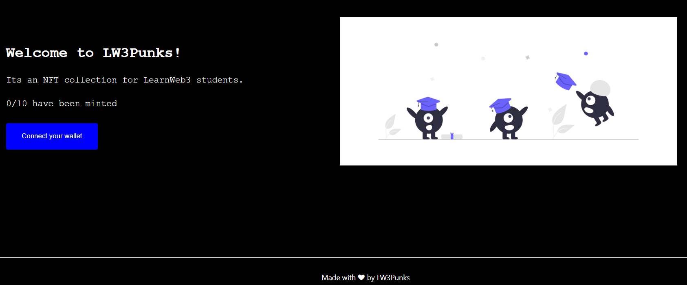
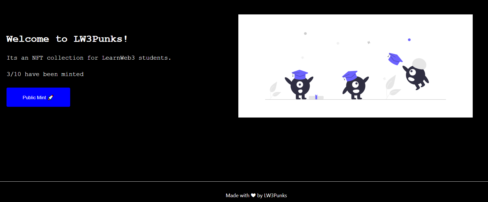

# Create an NFT Collection with metadata stored on IPFS

This repo contains coursework project from [LearnWeb3](https://learnweb3.io/) completed by [0xsenzel](https://github.com/0xSenzel/) for [LearnWeb3DAO-Junior](https://learnweb3.io/courses/6394ea7c-0ad6-4a4a-879f-7f9756bc5976/lessons) lesson.

## Project Info

Achieve true decentralization by hosting NFT images on IPFS service such as [Pinata](https://app.pinata.cloud/) in this project. User able to login with Polygon Mumbai wallet to mint 10 different NFT based on minting sequence.

## Project Demo

<figure>

<p align="center">Fig.1 - Home Page</p>
</figure>

<br/>

<figure>

<p align="center">Fig.2 - Connected with wallet</p>
</figure>

## Project Setup

### Hardhat

Head to [hardhat-tutorial](./hardhat-tutorial/) folder:

Install dependencies

```
npm install
```

Compile smart contract

```
npx hardhat compile
```

To deploy smart contracts: <br/>
Head to [hardhat.config.js](./hardhat-tutorial/hardhat.config.js) file, change the value of:

- `ALCHEMY_HTTP_URL` with your own Ethereum Network API
- `PRIVATE_KEY` with your Ethereum wallet's private key
- `POLYGONSCAN_API_KEY` with your Etherscan's API Key

Then run the following command.

```
npx hardhat run scripts/deploy.js --network goerli
npx hardhat verify --network mumbai YOUR_SMARTCONTRACT_ADDRESS "CONSTRUCTOR ARG1" "CONSTRUCTOR ARG2"
```

### React & Next Js

Head to [my-app](./my-app/) folder:

```
npm install
```

Replace the variable inside [this folder](./my-app/constants/index.js):

- `abi` with compiled ABI of contract.
- `NFT_CONTRACT_ADDRESS` with deployed contract of contract.

To run the app locally:

```
npm run dev
```
